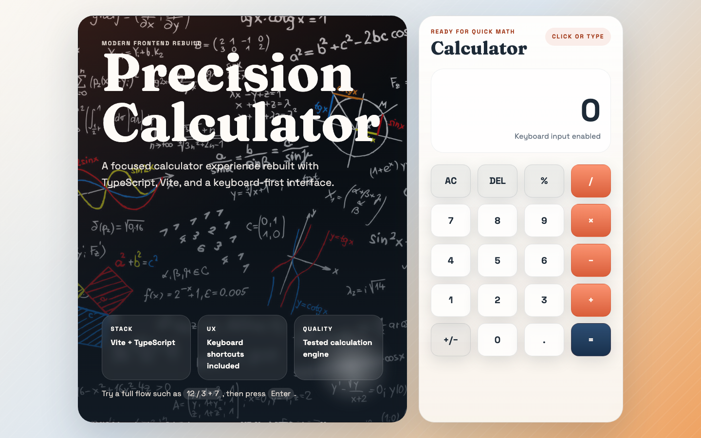
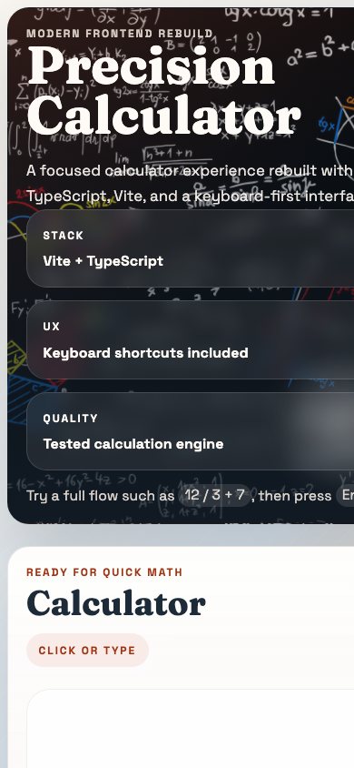

# Precision Calculator

A responsive calculator web app built with **TypeScript** and **Vite**. It started as a frontend school assignment and was later modernized into a cleaner, production-minded codebase with keyboard support, separated calculation logic, and automated tests.

[](https://precision-calculator-elli2022.netlify.app)

## Live demo

**https://precision-calculator-elli2022.netlify.app**

## Background

This repository began in March 2023 as **FE22 JavaScript 2 — Mini Project 4** (`FE22-js2-mp4`), a coursework calculator built with TypeScript and Parcel. It was **not** a final thesis project (`slutprojekt`) and **not** part of JavaScript 1 — the original repo name and README used the `js2` / `mp4` course naming convention.

The current version is a ground-up rebuild that keeps the same core idea while improving structure, tooling, accessibility, and deployment.

## Screenshots

| Desktop | Mobile |
| --- | --- |
|  |  |

## Features

- Four-function calculator with percentage support
- Keyboard input for digits, operators, `Enter`, `Backspace`, `%`, and `Escape`
- Expression preview and clear error handling for invalid operations
- Calculation engine separated from the UI for focused unit tests
- Responsive layout with a keyboard-first interaction model

## Tech stack

- TypeScript
- Vite
- Vitest
- ESLint
- Semantic HTML and vanilla CSS

## Getting started

### Prerequisites

- [Node.js](https://nodejs.org/) 20 or newer
- npm

### Install and run locally

```bash
git clone https://github.com/Elli2022/precision-calculator.git
cd precision-calculator
npm install
npm run dev
```

Open the local URL shown in the terminal (typically `http://localhost:5173`).

### Scripts

| Command | Description |
| --- | --- |
| `npm run dev` | Start the Vite dev server |
| `npm run build` | Production build to `dist/` |
| `npm run preview` | Preview the production build locally |
| `npm run test` | Run Vitest unit tests |
| `npm run lint` | Lint the project with ESLint |
| `npm run typecheck` | Type-check without emitting files |
| `npm run clean` | Remove build and coverage artifacts |

## Project structure

```text
.
├── index.html          # App shell and calculator markup
├── netlify.toml        # Netlify build and publish settings
├── screenshots/        # README visuals
├── src/
│   ├── calculator.ts       # Pure calculation logic
│   ├── calculator.test.ts  # Unit tests
│   ├── main.ts             # UI wiring and keyboard handling
│   ├── styles.css
│   └── images/
└── dist/               # Production output (generated, not committed)
```

## Deployment

The app is deployed on **Netlify** from the `main` branch:

- **Build command:** `npm run build`
- **Publish directory:** `dist`

`netlify.toml` in the repo defines these settings. GitHub Pages is no longer used for this project.

## Testing

```bash
npm run test
```

Tests cover the calculator engine (`src/calculator.test.ts`) independently of DOM code.

## License

ISC

## Author

Eleonora Nocentini
